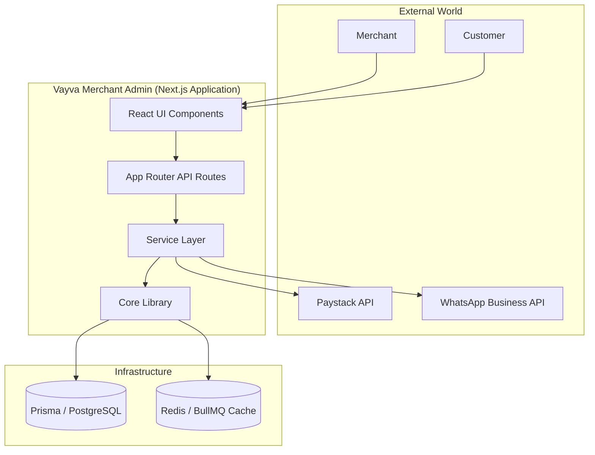
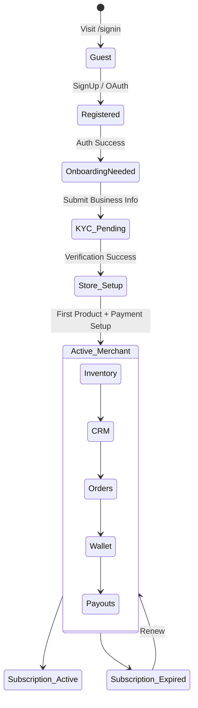
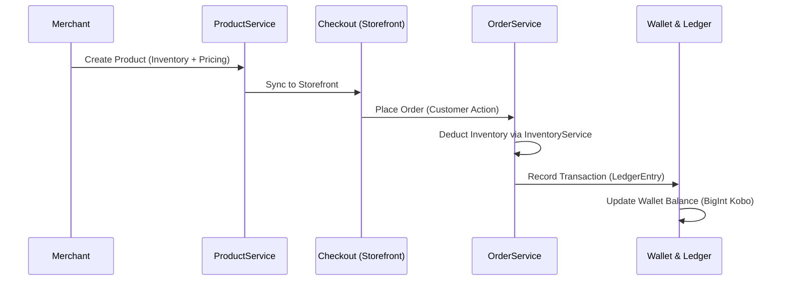
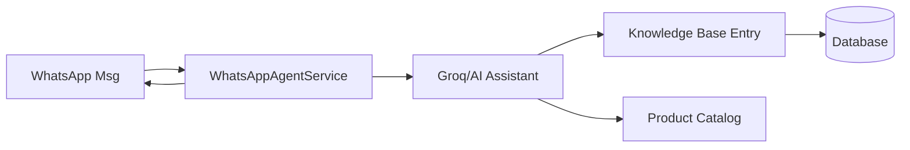

# Vayva Merchant Admin: Grand Architectural Map

This document provides a 360-degree technical and functional insight into the Vayva Merchant Admin platform.

## 1. High-Level System Architecture (C4 Model)

---

## 2. Integrated User Lifecycle & State Machine

---

## 3. Core Feature Interaction Matrix

### A. The Commerce Engine
How a product becomes an order and then money.

### B. The AI & Integration Engine
How Vayva automates the storefront experience.

---

## 4. Logical Module Map

| Module | Responsibility | Key Files |
| :--- | :--- | :--- |
| **Identity** | Session, JWT, RBAC | `auth.ts`, `middleware.ts`, `session.ts` |
| **Commerce** | Products, Inventory, Discounts | `product-core.service.ts`, `discountService.ts` |
| **Finance** | Wallet, Payouts, Ledger | `wallet.ts`, `ledgerService.ts`, `paystackService.ts` |
| **Logistics** | Fulfillment, Delivery (Kwik) | `fulfillmentService.ts`, `kwik.ts` |
| **Operations** | Kitchen (Food), Bookings (Tickets) | `kitchenService.ts`, `bookingService.ts` |
| **AI** | Storefront Automation, KB | `wa-agent.ts`, `ai-assistant.ts` |

---

> [!NOTE]
> This architecture is designed for multi-tenancy. Every request is isolated by `storeId` via the global `AuthContext` and `Prisma` query filters, ensuring extreme data privacy.

> [!IMPORTANT]
> **Branding Rule**: All UI entrance points (Skeletons, Auth Shell, Admin Shell) strictly enforce the usage of `vayva-logo-official.svg`.
