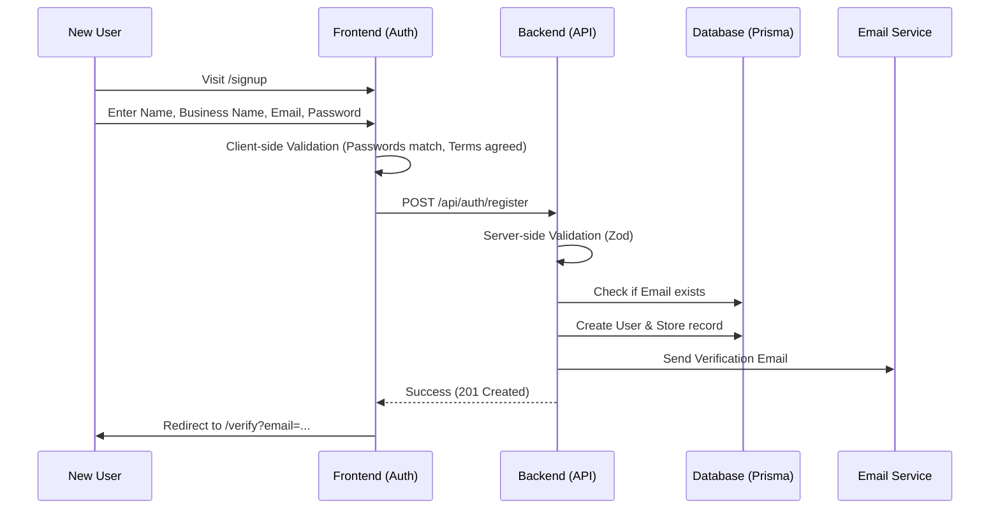
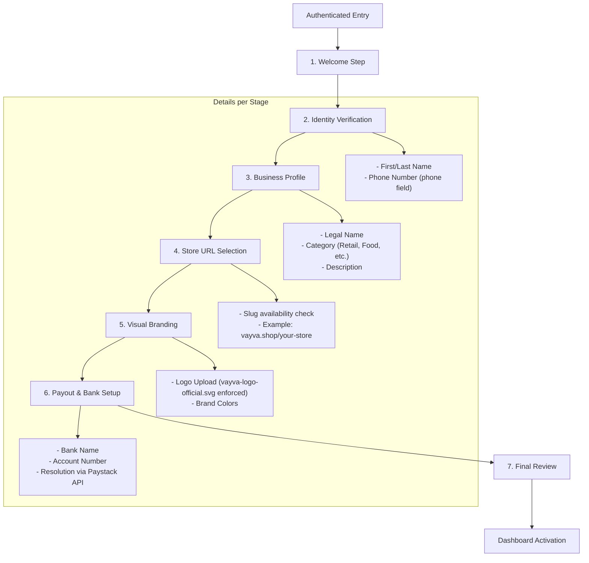
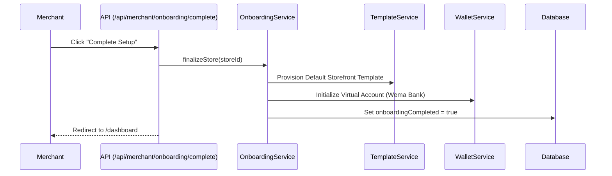

# Vayva: Detailed New User Onboarding Flow

This document provides an exhaustive breakdown of the merchant onboarding journey, from account creation to the production-ready dashboard.

## 1. Phase 1: Authentication & Registration

---

## 2. Phase 2: Structural Onboarding (/onboarding)

Once authenticated, users are guided through the `OnboardingContext` state machine.

---

## 3. Phase 3: Technical Finalization

Behind the scenes, the "Complete" button triggers a multi-service synchronization.

---

## 4. Logical Guardrails (Rules of the Flow)

- **Auth Requirement**: Every onboarding step is gated by a global `middleware.ts` that redirects to `/signin` if the JWT is invalid.
- **Data Persistence**: Each step uses `OnboardingContext` to save progress to the `Store` table via `JSON` settings or dedicated columns.
- **Branding Enforcement**: The UI prevents proceeding if placeholders are used instead of the official logo in the Branding step.

> [!TIP]
> **Pro-Tip**: Users can resume their journey at any time. The system reads the `onboardingLastStep` column from the `Store` model to pick up exactly where they left off.
