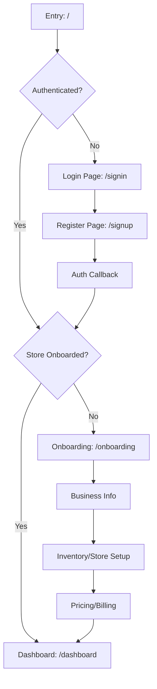
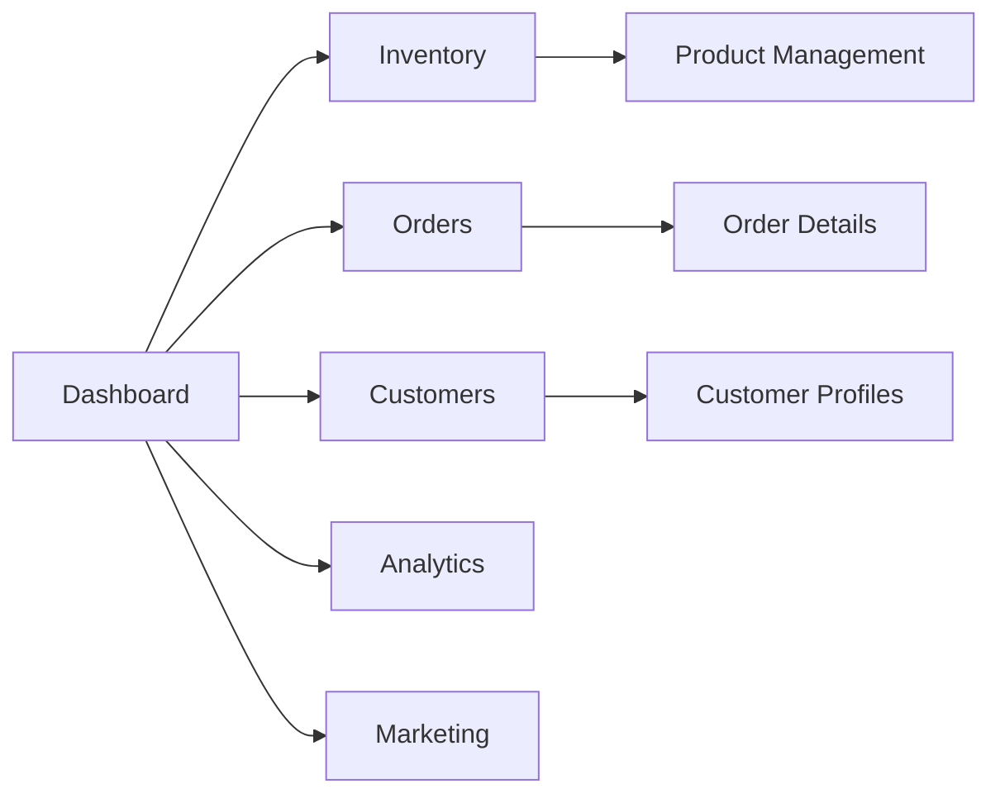
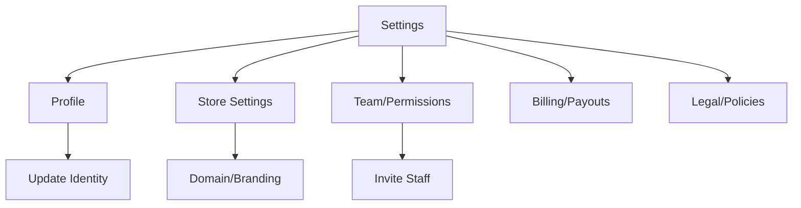
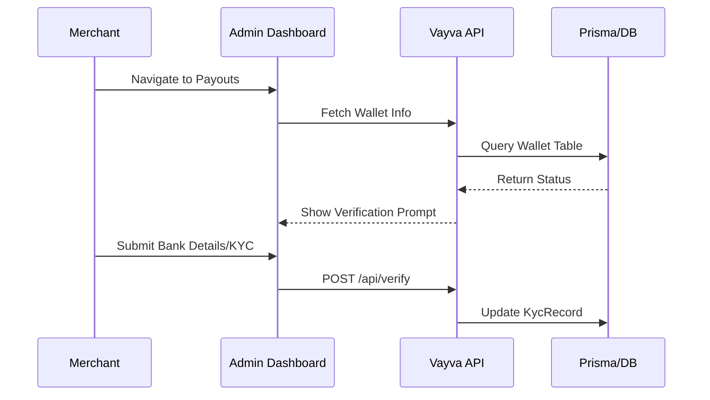

# Vayva Merchant Admin - Flow Documentation

This document outlines the primary navigation and authentication flows within the Vayva Merchant Admin application.

## 1. Authentication & Onboarding Flow

## 2. Core Dashboard Flow

## 3. Settings & Account Management

## 4. Key Security & Verification

---

> [!IMPORTANT]
> All flows are strictly protected by `AuthContext` and server-side session checks. The official Vayva branding is mandated at every entry point.
