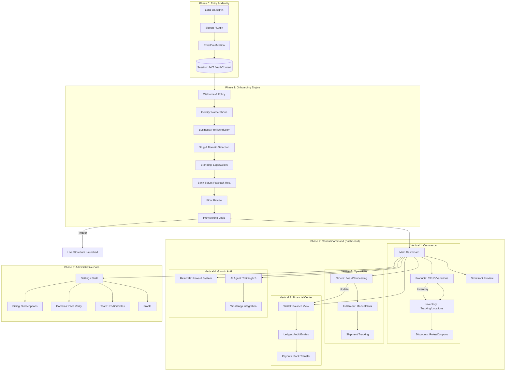

# Vayva Merchant Admin: Master Architectural & User Flow

This master document illustrates the high-fidelity flow of the Merchant Admin platform, detailing how data and users move through every critical stage of the lifecycle.

## 1. The Grand Journey (End-to-End)

---

## 2. Stage-by-Step Deep Dive

### Stage 1: Identity & Security
- **Data Flow**: `AuthService` -> `AuthContext` -> `localStorage`.
- **Enforcement**: `middleware.ts` intercepts every route to verify a valid JWT session before rendering dashboard components.

### Stage 2: The Provisioning Logic (The "Big Bang")
When a merchant clicks "Complete" on onboarding, the system executes:
1.  **Storefront Initialization**: Clones a default theme (e.g., `ChopNow` or `Retail`) and links it to the `storeId`.
2.  **Wallet Creation**: Registers a Virtual Account (Wema Bank) for real-time customer payments.
3.  **SEO Generation**: Automatically creates the `sitemap.xml` and `robots.txt` entries.

### Stage 3: The Transaction Lifecycle (Money & Stock)
1.  **Order Placement**: `api/orders` (Storefront) -> `OrderService` (Admin).
2.  **Fulfillment**: Moving an order from `PENDING` to `PROCESSING` triggers `InventoryService` to decrement stock across `InventoryLocation` items.
3.  **Ledger Conversion**: Successful payment converts `bigint` Kobo values from `PaymentTransaction` into "Available Balance" in the `Wallet`.

### Stage 4: Automation (AI Agent)
- **Knowledge Base**: Merchants upload PDFs or text to the `KnowledgeBaseService`.
- **Inference**: The `whatsapp-agent.ts` uses `Groq-SDK` to answer customer queries on the live storefront using the merchant's private KB.

---

## 3. Logical Dependency Map (Services)

| Area | Core Service | Critical Method | Outcome |
| :--- | :--- | :--- | :--- |
| **Onboarding** | `onboarding.service.ts` | `completeOnboarding()` | Sets `onboardingCompleted: true` |
| **Payments** | `paystackService.ts` | `resolveAccount()` | Verifies merchant bank details |
| **Inventory** | `inventory.service.ts` | `adjustStock()` | Atomic update of SKU availability |
| **Financials** | `ledgerService.ts` | `recordTransaction()` | Immutable record of flow of funds |
| **AI** | `wa-agent.ts` | `getSettings()` | Gated by `WHATSAPP_ENABLED` flag |

---

> [!IMPORTANT]
> **Production Rule**: Every state transition involving money or PII is logged in the `AuditLog` table via `ActivityLogger` to ensure absolute compliance and traceability.
